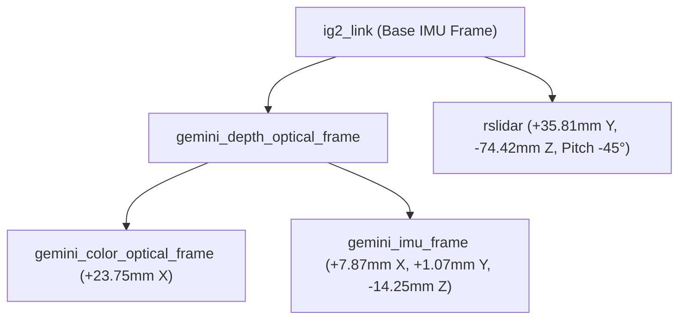

# scanR Golden Hardware Rig: Physical Sensor Layout & Datum Reference

**Author:** Antigravity AI & scanR Engineering  
**Base Frame:** IG-2 Dual RTK Module (`ig2_link`)  
**Coord System:** Right-Handed (+Y = Forward, +X = Left, +Z = Up)  

---

## 1. Mechanical Component Dimensions & Datums

```
                     [RoboSense Airy LiDAR]
                      (Tilted 45° Pitch Up)
                               /
                              /
                             v
               +---------------------------+
               | IG-2 Dual RTK Reference   |
               +---------------------------+
               | Orbbec Gemini 336L Camera |
               +---------------------------+
```

### A. InertialSense IG-2 Module
- **Primary Reference Datum:** IG-2 Housing Origin.
- **Printed Arrows:**
  - Printed $+Y$ arrow points **Forward**.
  - Printed $+X$ arrow points **Left**.
  - Right-handed $+Z$ points **Up**.

### B. Orbbec Gemini 336L Camera
- **Orientation:** Forward-facing.
- **Mounting Datum:** Two center threaded screw holes on camera back.
- **Vertical Distance:** $1.27\text{ in}$ ($32.26\text{ mm}$) below IG-2 underside.
- **Forward Distance:** $0.67\text{ in}$ ($17.02\text{ mm}$) from IG-2 front to Gemini front glass plane.
- **Optical Center Setback:** $+7.0\text{ mm}$ behind front glass plane.
- **Total Y-Offset (Depth Optical Center):** $+24.018\text{ mm}$ ($+0.024018\text{ m}$).

### C. RoboSense Airy LiDAR
- **Orientation:** Dome facing forward, tilted $45^\circ$ upward pitch to sky.
- **Connector:** 3-in-1 cable connector on right side (opposite IG-2 $+X$ arrow).
- **Vertical Distance:** $2.93\text{ in}$ ($74.422\text{ mm}$) below IG-2 underside datum.
- **Forward Distance:** $1.41\text{ in}$ ($35.814\text{ mm}$) forward from IG-2 front face.
- **Lateral Offset:** Centered ($X = 0.0\text{ mm}$).

---

## 2. TF Frame Hierarchy



---

## 3. Calibration Status & Next Steps

- **Milestone 3 (Current):** Working initial CAD extrinsics configured for Fast-LIVO2 SLAM bring-up.
- **Milestone 5 (Active):** Hardware synchronization cable integration and timing verification pass.
- **Milestone 6/7 (Future Target):** Targetless / Kalibr spatio-temporal refinement and hardware PPS sync optimization.

---

## 4. Hardware Synchronization Cable Pinout & Timing Architecture

The physical sync cable establishes the **InertialSense IG-2** as the master timing hub.

```
                    +-------------------+
                    |   IG-2 Dual RTK   |
                    | Master Reference  |
                    +---------+---------+
                              |
            +-----------------+-----------------+
            |                 |                 |
     H1-6 STROBE          H1-7 Tx0          H1-14 PPS
     (Input)           (RS232 Output)        (Output)
            ^                 |                 |
            |                 v                 v
       336L Pin 3         Airy Pin 1        Airy Pin 3
       VSYNC_OUT          GPS_GPRMC          GPS_PPS
 (Gemini Pin 8 GND <---> IG-2 H1-1 GND <---> Airy Pin 4 GND)
 (Gemini Pin 4: UNCONNECTED / NOT USED)
```

### Complete Sync Wiring Matrix

| IG-2 H1 Pin | Connected Device & Pin | Signal Function | Direction |
| :--- | :--- | :--- | :--- |
| **H1-1** | Gemini 336L Pin 8 & Airy Pin 4 | Common Ground (`GND`) | Ground Reference |
| **H1-6** | Gemini 336L Pin 3 (`VSYNC_OUT`) | Strobe / VSYNC trigger pulse | Input to IG-2 (`DID_STROBE_IN_TIME`) |
| **H1-7** | RoboSense Airy Pin 1 (`GPS_GPRMC`) | NMEA GPRMC GPS sentence via MAX3232 RS-232 | Output from IG-2 to Airy |
| **H1-14** | RoboSense Airy Pin 3 (`GPS_PPS`) | 1-PPS timing pulse | Output from IG-2 to Airy |
